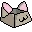

<div align="center">
  
  
  <h1 align="center">[GAME_NAME]</h1>
  <p align="center">
    A stunning 3D typing game built with modern web technologies. 
    <br />
    Explore, survive, and type your way to victory!
  </p>

  <h3>
    ✨ <a href="https://tsuki-dev.fr"><strong>PLAY THE GAME LIVE NOW AT TSUKI-DEV.FR</strong></a> ✨
  </h3>

  <p align="center">
    <a href="#features"><strong>Explore the features »</strong></a>
    <br />
    <br />
    <a href="https://github.com/FamilyTsuki">Report Bug</a>
    ·
    <a href="https://github.com/FamilyTsuki">Request Feature</a>
  </p>
</div>

<div align="center">

[](https://opensource.org/licenses/MIT)
[](https://nodejs.org/)
[](https://postgresql.org)
[](https://threejs.org/)

</div>

---

<details open>
  <summary>Table of Contents</summary>
  <ol>
    <li><a href="#about-the-project">About The Project</a></li>
    <li><a href="#how-to-play">How to Play</a></li>
    <li><a href="#features">Features</a></li>
    <li><a href="#project-architecture">Project Architecture</a></li>
    <li><a href="#getting-started">Getting Started</a></li>
    <li><a href="#license">License</a></li>
    <li><a href="#contact">Contact</a></li>
  </ol>
</details>

## About The Project

**[GAME_NAME]** is built around a simple yet powerful philosophy: **natural learning through immersion**. The core principle is to plunge the player into an engaging, high-stakes 3D environment where mastering the keyboard is the only way to survive. By blending fast-paced gameplay with typing mechanics, players naturally improve their typing speed and accuracy without ever feeling the tedious "obligation to learn."

Moving away from traditional 2D web interfaces, this project utilizes WebGL and modern CSS to create an incredibly immersive experience. Alongside the core game, the project includes a fully featured website with user accounts, a community hub, advanced settings, and an administration dashboard.

## How to Play

The concept is simple but hard to master:
* ⌨️ **Your Keyboard is Your Weapon:** Words appear above incoming enemies. Type the exact word to attack and destroy them.
* 🏃 **Survive:** The longer you last, the faster and more complex the words become, dynamically adapting to your skill level.
* 🧠 **Natural Learning:** The game is designed so that your muscle memory improves organically while you focus on surviving the siege.

## Features

* 🎮 **Immersive 3D Typing Engine:** Fast-paced WebGL gameplay using Three.js.
* 🌓 **Dynamic Theming:** Seamless Dark and Light modes featuring modern Glassmorphism aesthetics.
* 🔐 **Secure Authentication:** JWT-based sessions using HTTP-only cookies.
* 🌐 **Localization:** Complete multi-language support (i18n) for international players.
* 💬 **Community Hub:** Share posts, interact with the community, and track progress.
* 🤖 **AI Moderation:** Integrated Google Gemini API for intelligent content moderation on the Hub.
* 🛡️ **Admin Dashboard:** Powerful tools to manage users, game levels, and community posts.

## Project Architecture

We take pride in our **Clean Code** architecture. The project deliberately avoids heavy frontend frameworks (like React or Vue) to maintain maximum performance, control, and to demonstrate advanced Vanilla JavaScript patterns.

```text
Final-Project/
├── backend/                  # Node.js / Express Server
│   ├── src/
│   │   ├── controllers/      # API Logic & AI Moderation
│   │   ├── middlewares/      # JWT, Roles, Rate-limiting
│   │   ├── models/           # Database interactions (PostgreSQL)
│   │   ├── routes/           # Express routers
│   │   └── config/           # Database Init scripts (init.sql)
│
├── frontend/                 # Vanilla JS / WebGL Frontend
│   ├── public/
│   │   ├── asset/            # Images, CSS Variables, Global styles
│   │   └── index.html        # Single Entry Point
│   ├── src/
│   │   ├── core/             # Router, i18n, API Services
│   │   ├── game/             # Three.js Engine, Actors, Physics
│   │   └── website/          # Web Views (Hub, Profile, Admin)
```

## Getting Started

To get a local copy up and running, follow these simple steps.

### Prerequisites

* Node.js (v16 or higher)
* PostgreSQL (Running locally or via Docker)

### Installation

1. Clone the repository
   ```sh
   git clone https://github.com/FamilyTsuki/Final-Project.git
   ```
2. Install NPM packages
   ```sh
   cd Final-Project
   npm install
   ```
3. Set up the PostgreSQL Database
   * Create a new database named `keyboardsurvivor`.
   * Execute the initialization script located at `backend/src/config/init.sql` (or similar) in your database.
4. Set up your `.env` file based on `.env.example`
   ```env
   PORT=5000
   DB_USER=your_postgres_user
   DB_PASSWORD=your_postgres_password
   DB_HOST=localhost
   DB_PORT=5432
   DB_NAME=keyboardsurvivor
   JWT_SECRET=your_jwt_secret
   GEMINI_API_KEY=your_gemini_key
   ```
5. Start the development server
   ```sh
   npm run dev
   ```

## License

Distributed under the MIT License.

## Contact

Project Link: [https://github.com/FamilyTsuki/Final-Project](https://github.com/FamilyTsuki/Final-Project)
