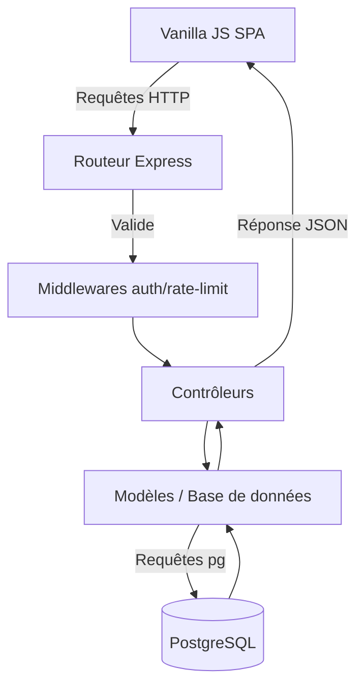

*Read this in other languages: [English](TECHNICAL_ARCHITECTURE.md)*

  <h1>Architecture Technique : [GAME_NAME]</h1>
  
Vue d'ensemble complète de la stack, des décisions architecturales et de l'organisation du code.

L'application repose sur une **architecture Client-Serveur découplée**, garantissant une flexibilité et des performances maximales. Un choix de conception fondamental a été d'éviter les frameworks front-end lourds (comme React ou Vue) afin de conserver un contrôle absolu sur la boucle de rendu 3D et d'adhérer strictement aux principes du Vanilla JavaScript.

---

## 1. Le Backend (Node.js & Express)

Le backend sert d'API REST pour le site web et le jeu. Il gère l'authentification, les états de sauvegarde et le Hub communautaire, en suivant rigoureusement le modèle **MVC (Modèle-Vue-Contrôleur)**.

### Flux Architectural

### Structure des Répertoires (`/backend/src/`)
- **`controllers/`** : Logique métier (ex. vérification des identifiants, création d'un post).
- **`models/`** : Couche d'accès à la base de données (utilisation directe du module `pg` pour des requêtes optimisées).
- **`routes/`** : Configuration du routage liant les points d'entrée HTTP aux contrôleurs.
- **`middlewares/`** : Fonctions d'interception critiques pour la sécurité (`auth.middleware.js` pour valider les JWT, limiteurs de débit).
- **`utils/`** : Utilitaires partagés (ex. `mailer.js` pour les emails SMTP de récupération de mot de passe).

### Sécurité & Optimisations > [!IMPORTANT]
> La sécurité est gérée à plusieurs niveaux pour prévenir les vulnérabilités courantes et les abus.

- **Authentification Stateless** : Gérée via des **JSON Web Tokens (JWT)** stockés dans des cookies HttpOnly.
- **Mots de passe** : Hachés avec **bcrypt**. Les tokens de récupération de compte sont des clés hexadécimales sécurisées de 64 caractères.
- **Middlewares** : 
  - `helmet` (En-têtes HTTP sécurisés)
  - `xss-clean` (Protection contre les injections XSS)
  - `express-rate-limit` (Prévention contre le spam et les attaques DDoS)
  - `cors` (Contrôle d'accès)
  - `compression` (Compression Gzip des réponses pour réduire la bande passante)

---

## 2. Le Frontend Web (Vanilla JavaScript)

La structure web (Navigation, Hub, Connexion) est construite en pur JavaScript Orienté Objet (Vanilla JS).

> [!TIP]
> En évitant la surcharge d'un DOM virtuel, l'interface utilisateur reste ultra-rapide et se synchronise parfaitement avec les contraintes du moteur de jeu 3D.

### Routeur Sur-Mesure (`core/Router.js`)
L'application fonctionne comme une **Single Page Application (SPA)** utilisant un routeur développé sur-mesure exploitant l'API History (`pushState`).
- **Chargement Dynamique** : Le routeur injecte automatiquement les fichiers CSS spécifiques à la vue chargée.
- **Anti-Scintillement** : Un système anti-rebond (250ms) empêche l'écran de chargement global de clignoter inutilement lors de requêtes réseau rapides.

### Architecture UI
- **DOMBuilder (`core/utils/DOMBuilder.js`)** : Fonction utilitaire `el()` permettant de construire l'arbre DOM via JavaScript de manière lisible et imbriquée (similaire au `createElement` de React).
- **Vues (`website/views/`)** : Chaque page (Accueil, Hub, Connexion) est une classe héritant de `AbstractView`.
- **Services (`core/services/`)** : Classes Singleton abstrayant les appels API (ex. `AuthService`, `PostsService`). Un intercepteur global sur `window.fetch` affiche automatiquement un mini-chargeur lors de l'activité réseau.

### CSS & Design
- **Vanilla CSS** : Aucun framework externe (pas de Tailwind/Bootstrap).
- **Design Composant** : Les classes utilitaires partagées (`.btn-primary`, `.glass-panel`) sont centralisées dans `components/base.css`.
- **Thématisation** : Utilisation intensive des Propriétés Personnalisées CSS (Variables) dans `global.css` pour gérer le mode Clair/Sombre dynamique, les ombres néon et les effets de Glassmorphism.

---

## 3. Le Moteur de Jeu (`frontend/src/game/`)

C'est le cœur interactif de [GAME_NAME]. Totalement indépendant des vues web, il est structuré pour gérer les entités 3D et les entrées clavier avec de hautes performances.

### Écosystème 3D
- **Three.js** : Bibliothèque WebGL utilisée pour le rendu du monde (Lumières, Modèles GLTF, Animations procédurales).
- **GSAP (GreenSock)** : Utilisé pour fluidifier les animations complexes et les effets de défilement en dehors de la boucle principale du jeu.

### Structure du Code du Jeu
- **`engine/` (GameEngine)** : Gère l'initialisation de Three.js et la boucle de rendu infinie via `requestAnimationFrame` visant 60 FPS.
- **`phases/`** : Séparation stricte des états de jeu utilisant des classes dédiées :
  - `ExplorePhase` : Course dans le couloir hexagonal.
  - `EventPhase` : Jeu de frappe pour surmonter des obstacles ou des événements aléatoires.
  - `ArenaPhase` : Combats de boss et survie sur la grille du clavier physique.
- **`managers/` (ex. KeyboardManager)** : Module vital qui écoute passivement les frappes, valide les mots saisis et déclenche les Événements ou les sorts (`FIRE`, `HEAL`).
- **`events/` & `models/`** : Contiennent la logique des entités (Joueur, Bugs, Mots cibles comme `BridgeWordEvent.js`).

---

## 4. Standards de Développement ("Clean Code")

> [!NOTE]
> Maintenir une base de code propre et évolutive est notre priorité absolue.

- **Nommage & Langue** : L'ensemble de la base de code (noms de fichiers, variables, classes, commentaires techniques) est rédigé en **Anglais**, respectant ainsi les normes professionnelles de l'industrie.
- **Lisibilité** : Le code doit être explicite par lui-même. La logique lourde est fragmentée en petites fonctions aux noms clairs plutôt que d'être noyée sous des commentaires.
- **Asynchronisme** : Utilisation généralisée de `async/await` pour éviter l'enfer des callbacks (callback hell), particulièrement lors du chargement des textures Three.js et du traitement des requêtes réseau.
