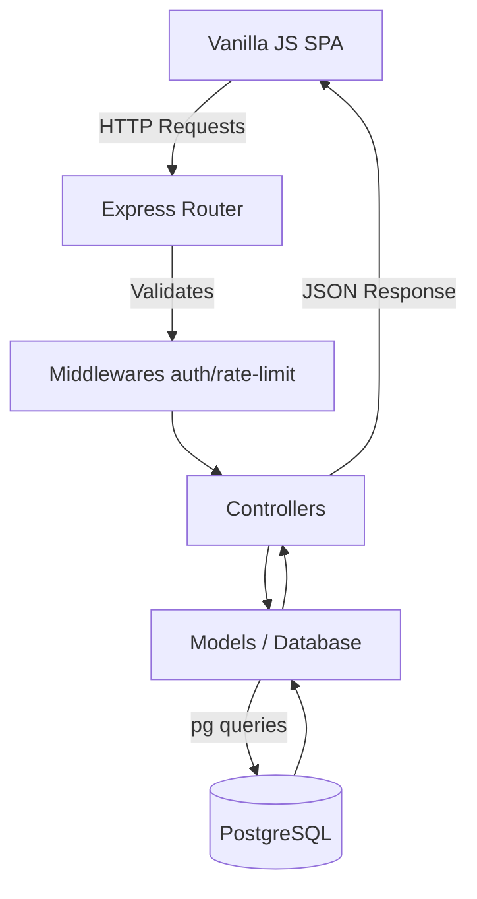

*Read this in other languages: [Français](TECHNICAL_ARCHITECTURE.fr.md)*

  <h1>Technical Architecture: [GAME_NAME]</h1>
  
Comprehensive overview of the stack, architectural decisions, and codebase organization.

The application is built upon a **Decoupled Client-Server architecture**, ensuring maximum flexibility and performance. A core design decision was to avoid heavy front-end frameworks (like React or Vue) to maintain absolute control over the 3D rendering loop and adhere to strict Vanilla JavaScript patterns.

---

## 1. The Backend (Node.js & Express)

The backend serves as a REST API for both the website and the game. It handles authentication, save states, and the community Hub, strictly following the **MVC (Model-View-Controller)** pattern.

### Architecture Flow

### Directory Structure (`/backend/src/`)
- **`controllers/`**: Business logic (e.g., verifying credentials, creating a post).
- **`models/`**: Database access layer (direct use of the `pg` module for optimized queries).
- **`routes/`**: Routing configuration mapping HTTP endpoints to controllers.
- **`middlewares/`**: Critical interception functions for security (`auth.middleware.js` to validate JWTs, rate limiters).
- **`utils/`**: Shared utilities (e.g., `mailer.js` for SMTP password recovery emails).

### Security & Optimizations > [!IMPORTANT]
> Security is handled at multiple layers to prevent common vulnerabilities and abuse.

- **Stateless Authentication**: Managed via **JSON Web Tokens (JWT)** stored in HttpOnly cookies.
- **Passwords**: Hashed using **bcrypt**. Account recovery tokens are secure 64-character hexadecimal keys.
- **Middlewares**: 
  - `helmet` (Secure HTTP headers)
  - `xss-clean` (Protection against XSS injections)
  - `express-rate-limit` (Prevention against spam and DDoS attacks)
  - `cors` (Access control)
  - `compression` (Gzip compression of responses to reduce bandwidth usage)

---

## 2. The Web Frontend (Vanilla JavaScript)

The web structure (Navigation, Hub, Login) is built in pure Object-Oriented JavaScript (Vanilla JS).

> [!TIP]
> By avoiding virtual DOM overhead, the UI remains lightning-fast and perfectly syncs with the 3D game engine constraints.

### Custom Router (`core/Router.js`)
The application operates as a **Single Page Application (SPA)** using a custom-built router leveraging the History API (`pushState`).
- **Dynamic Loading**: The router automatically injects CSS files specific to the loaded view.
- **Anti-Flicker**: A debounce system (250ms) prevents the global loading screen from flashing unnecessarily on fast network requests.

### UI Architecture
- **DOMBuilder (`core/utils/DOMBuilder.js`)**: Utility function `el()` to build the DOM tree via JavaScript in a readable, nested way (similar to React's `createElement`).
- **Views (`website/views/`)**: Each page (Home, Hub, Login) is a class inheriting from `AbstractView`.
- **Services (`core/services/`)**: Singleton classes abstracting API calls (e.g., `AuthService`, `PostsService`). A global interceptor on `window.fetch` automatically displays a mini-loader during network activity.

### CSS & Design
- **Vanilla CSS**: No external frameworks (no Tailwind/Bootstrap).
- **Componentized Design**: Shared utility classes (`.btn-primary`, `.glass-panel`) are centralized in `components/base.css`.
- **Theming**: Heavy use of CSS Custom Properties in `global.css` for dynamic Light/Dark mode, neon shadows, and Glassmorphism effects.

---

## 3. The Game Engine (`frontend/src/game/`)

This is the interactive core of [GAME_NAME]. Completely independent of the web views, it is structured to manage 3D entities and keyboard inputs with high performance.

### 3D Ecosystem
- **Three.js**: WebGL library used for world rendering (Lights, GLTF Models, Procedural animations).
- **GSAP (GreenSock)**: Used to smooth out complex animations and scroll effects outside the main game loop.

### Game Code Structure
- **`engine/` (GameEngine)**: Handles Three.js initialization and the infinite rendering loop via `requestAnimationFrame` targeting 60 FPS.
- **`phases/`**: Strict separation of game states using dedicated classes:
  - `ExplorePhase`: Running in the hexagonal corridor.
  - `EventPhase`: Typing game to overcome obstacles or random events.
  - `ArenaPhase`: Boss fights and survival on the physical keyboard grid.
- **`managers/` (e.g., KeyboardManager)**: A vital module that passively listens to keystrokes, validates typed words, and triggers Events or spells (`FIRE`, `HEAL`).
- **`events/` & `models/`**: Contain the logic for entities (Player, Bugs, Target Words like `BridgeWordEvent.js`).

---

## 4. Development Standards ("Clean Code")

> [!NOTE]
> Maintaining a clean and scalable codebase is our highest priority.

- **Naming & Language**: The entire codebase (filenames, variables, classes, technical comments) is written in **English**, adhering to professional industry standards.
- **Readability**: Code must be self-explanatory. Heavy logic is fragmented into small, explicitly named functions rather than being buried under comments.
- **Asynchronicity**: Widespread use of `async/await` to avoid callback hell, particularly when loading Three.js textures and handling network requests.
